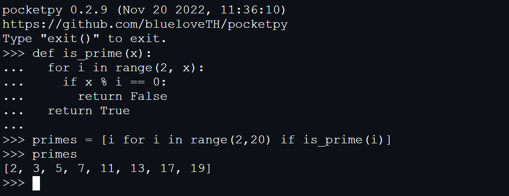

# pocketpy

PocketPy is a lightweight(~5000 LOC) Python interpreter for game engines.

It is extremely easy to embed. Including a compiler, optimizer and bytecode virtual machine. All of them are available in a single header file `pocketpy.h`, without external dependencies.

Please see https://pocketpy.dev for details or try [Live Demo](https://blueloveth.github.io/pocketpy).

## News

PocketPy is undergoing a major reconstruction.
The next version, `0.8.x`, is a huge break change compared with `0.6.x`.

Changes in `0.8.x`:
1. better way for C bindings/host bindings
2. try/catch support
3. yield/coroutine support (we will try to implement asyncio)
4. complete reflection (exec/eval/getattr/setattr/hasattr)
5. bytecode optimizer (will improve the performance by 2x-3x)

Since the main purpose of PocketPy is for game engines, which is usually single-threaded. We will change some designs to fit this situation.
All threaded interfaces will be deleted. PocketPy will no longer provide thread support at the C language level. If one needs to run the virtual machine in a thread, we recommend to use the thread support provided by the host language.

## Reference

+ [cpython](https://github.com/python/cpython)

+ [byterun](http://qingyunha.github.io/taotao/)

+ [emhash](https://github.com/ktprime/emhash)

## License

MIT License
