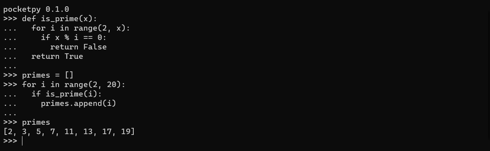

# pocketpy


C++17 single-file header-only cross platform Python Interpreter.

`pocketpy` is being heavy development now.

You can [try our demo on your browser](https://blueloveth.github.io/pocketpy/) or [download a prebuilt windows binary](https://github.com/blueloveTH/pocketpy/actions/workflows/main.yml).



## Build From Source (Linux)

First clone the repository

```bash
git clone https://github.com/blueloveTH/pocketpy
cd pocketpy
```

**If you want to get a single header file:**

```bash
python3 amalgamate.py
```

It will generate `pocketpy.h` and `main.cpp` in `amalgamated/` directory. You can use `main.cpp` to build a REPL console or use `pocketpy.h` only to embed it to your game engine.

**If you want to do development:**

```bash
g++ -o pocketpy src/main.cpp --std=c++17 -O1
```
## Flutter Plugin

https://github.com/blueloveTH/pocketpy-flutter

## Reference

+ [cpython](https://github.com/python/cpython)

+ [byterun](http://qingyunha.github.io/taotao/)

