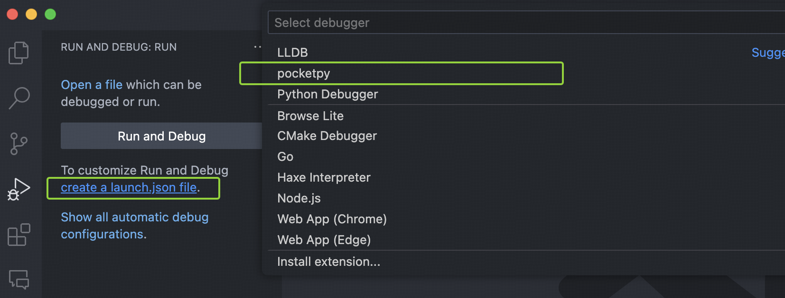
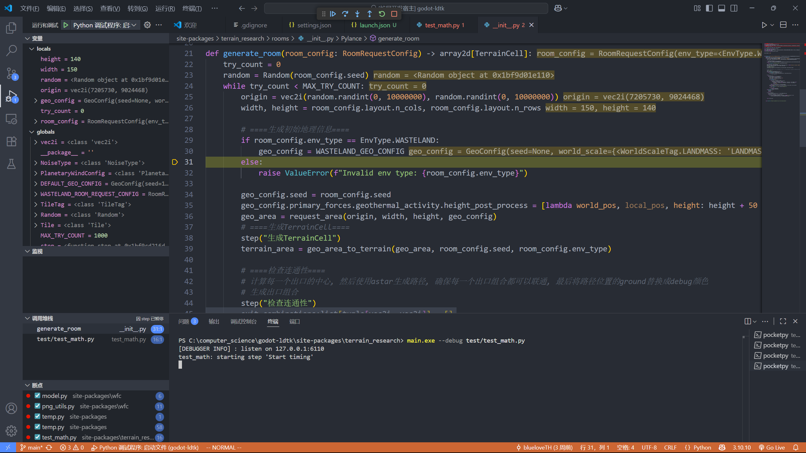

## Install VSCode Extension

To debug a pocketpy program, you need to install our VSCode extension first:

https://marketplace.visualstudio.com/items?itemName=pocketpy.pocketpy

!!!
The VSCode extension requires pocketpy version >= `2.1.1`
!!!

## Create a `launch.json` file

Navigate to the Debug view in VSCode, and click on "create a launch.json file" link.
In the dropdown menu, select "pocketpy".



Then a default `launch.json` file will be created in the `.vscode` folder
with a sample pocketpy debug configuration.

## How does it work?

pocketpy provides a C-API `py_debugger_waitforattach`,
which starts a debug server and waits for the VSCode extension to attach.
When the debugger is attached, the program will continue to run.

+ If you are using pocketpy's standalone executable `main.exe`, you can pass `--debug` flag to it. This will automatically call `py_debugger_waitforattach("127.0.0.1", 6110)` before running your program.
+ If you are embedding pocketpy as a library, you need to call `py_debugger_waitforattach` manually in your C/C++ code.

## Configuration

+ `type`: must be `pocketpy`
+ `request`: can be `attach` or `launch`
+ `name`: the name of this configuration
+ `port`: the port number of the debug server, must match the one in `py_debugger_waitforattach`
+ `host`: the host of the debug server, must match the one in `py_debugger_waitforattach`
+ `sourceFolder`: the root folder of your python source code, default to `${workspaceFolder}`. However,
sometimes you may run your program from a subfolder, in this case you need to set `sourceFolder` to the correct path. If this is not set correctly, breakpoints will not be hit.
+ `program`: (for launch mode only) the path to the executable file which calls `py_debugger_waitforattach`, e.g. the pocketpy standalone executable `main.exe`.
+ `args`: (for launch mode only) the arguments to pass to the executable file, e.g. `--debug` and the script path if you are using `main.exe`.
+ `cwd`: (for launch mode only) the working directory to launch the executable file, default to `${workspaceFolder}`.

### For attach mode

In this mode, you need to start your pocketpy program manually which must call `py_debugger_waitforattach` first.
After the program starts, you can let VSCode attach to the debug server.

```json
{
    "type": "pocketpy",
    "request": "attach",
    "name": "Attach to pocketpy program",
    "port": 6110,
    "host": "localhost",
    "sourceFolder": "${workspaceFolder}"
}
```

### For launch mode

In this mode, VSCode will start your program with the specified `program`, `args` and `cwd`.
After the program starts, VSCode attempts to attach to the debug server automatically.

```json
{
    "type": "pocketpy",
    "request": "launch",
    "name": "Launch pocketpy program",
    "port": 6110,
    "host": "localhost",
    "sourceFolder": "${workspaceFolder}",
    "program": "${workspaceFolder}/pocketpy/main.exe",
    "args": [
        "--debug"
    ],
    "cwd": "${workspaceFolder}"
}
```

## Showcase


