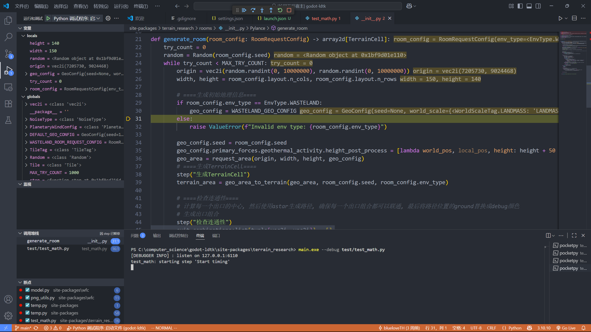

# Debugging

The [pocketpy VS Code extension](https://marketplace.visualstudio.com/items?itemName=pocketpy.pocketpy)
connects to the interpreter's debug server. Use a build with OS support for the
default transport, and keep the Python sources used by that build available.

## Launch a standalone script

Install the extension, then create `.vscode/launch.json` in your project.
For a Visual Studio build of pocketpy in the workspace root:

```json
{
    "version": "0.2.0",
    "configurations": [
        {
            "type": "pocketpy",
            "request": "launch",
            "name": "Debug app.py",
            "program": "${workspaceFolder}/build/Release/main.exe",
            "args": ["--debug", "app.py"],
            "cwd": "${workspaceFolder}",
            "host": "127.0.0.1",
            "port": 6110,
            "sourceFolder": "${workspaceFolder}"
        }
    ]
}
```

Set `program` to your actual executable, for example
`${workspaceFolder}/build/main` for a single-configuration Unix build.
Set a breakpoint in `app.py` and start the configuration.

The script argument is required: running without a filename opens the REPL,
where `--debug` is ignored. Do not combine `--debug` with `--profile` or
`--compile`.

## Attach to an embedded application

Call `py_debugger_waitforattach("127.0.0.1", 6110)` after initialization and
before executing the code to debug. The call waits for a debugger connection.
The standalone `--debug` option makes this call for you.

To attach, add this entry to your `configurations` array and start the host
application yourself:

```json
{
    "type": "pocketpy",
    "request": "attach",
    "name": "Attach to host",
    "host": "127.0.0.1",
    "port": 6110,
    "sourceFolder": "${workspaceFolder}"
}
```

Use the same host and port in both the native call and the configuration.
The extension's [source repository](https://github.com/pocketpy/pocketpy-vscode-extension)
contains the debugger client.

## Paths and troubleshooting

| Symptom | Check |
| --- | --- |
| Program waits before executing | This is expected until the debugger attaches. |
| Connection fails | Confirm that the host reached `py_debugger_waitforattach`, OS support is enabled, and host/port match. |
| Breakpoints do not bind | Match `sourceFolder` to the source paths recorded during compilation. |
| Local imports fail | Set `cwd` to the script import root; `sourceFolder` does not change imports. |
| Source lines are unavailable | Use the original source revision; bytecode files do not embed source text. |

When embedding, provide meaningful filenames to `py_exec()`.
Changing `sourceFolder` only affects debugger source lookup.


