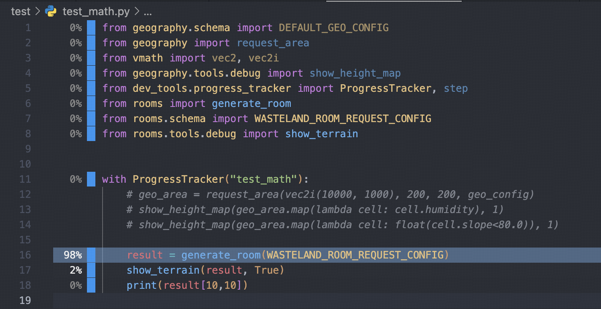

To profile your pocketpy program, you can run `main.exe` with `--profile` flag.

For example, to profile `test/test_math.py`, run

```
main.exe --profile test/test_math.py
```

This will output a JSON report file named `profile_report.json` in the current directory,
which records the time spent for each line. To visualize the report, please install our VSCode extension.

https://marketplace.visualstudio.com/items?itemName=pocketpy.pocketpy

!!!
The VSCode extension requires pocketpy version >= `2.1.1`
!!!

With pocketpy VSCode extension, press `F1` and type `pocketpy: Load Line Profiler Report`,
select **1. the `profile_report.json` file; 2. the source root of the program**. Then you will see a nice visualization of the profiling result.



Press `ESC` to exit the report view.
