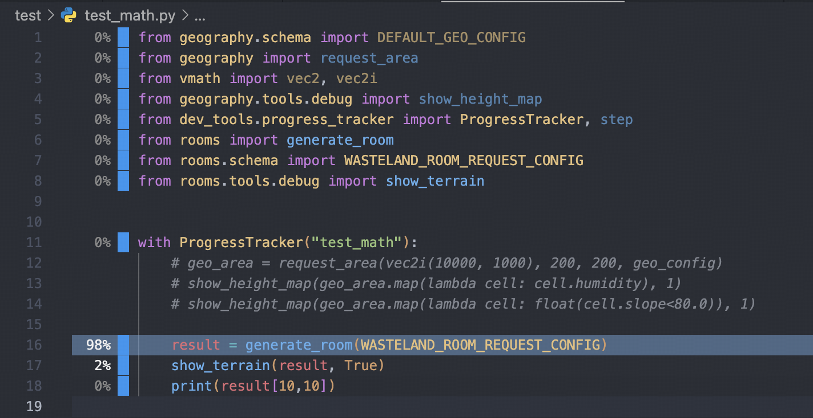

# Profiling

The line profiler shows where a script spends execution time.
Use it to locate expensive lines, then [measure performance](../performance.md)
again without profiling overhead.

## Record a report

Run a script with `--profile`:

```sh
./build/main --profile app.py
```

For a Visual Studio build on Windows:

```powershell
.\build\Release\main.exe --profile app.py
```

The executable writes **`profiler_report.json`** in its current working
directory. Make sure that directory is writable.
Do not combine `--profile` with `--debug` or `--compile`; profiling without
a script filename is ignored in REPL mode.

## View the report

Install the [pocketpy VS Code extension](https://marketplace.visualstudio.com/items?itemName=pocketpy.pocketpy).
Open the command palette and run **pocketpy: Load Line Profiler Report**.
Select the report, then the root folder containing the matching Python sources.
Press Escape to leave the report view.



If annotations appear on the wrong lines, check that the sources match the
profiled version and that the selected source root is correct.

## Profile execution in an embedded host

Start profiling **before entering Python execution**, then stop it when that
execution returns. This complete C program prints the report as JSON:

```c
#include "pocketpy.h"
#include <stdio.h>

int main(void) {
    py_initialize();
    py_StackRef base = py_peek(0);

    py_profiler_reset();
    py_profiler_begin();
    bool ok = py_exec("total = sum([i * i for i in range(1000)])\n",
                      "app.py", EXEC_MODE, NULL);
    py_profiler_end();

    if(!ok) {
        py_printexc();
        py_clearexc(base);
    }
    char* report = py_profiler_report();
    puts(report);
    py_free(report);

    py_finalize();
    return ok ? 0 : 1;
}
```

The C report function returns allocated JSON text. Save it or print it, then
release it with `py_free()`. Profiling uses the VM's trace callback, so
coordinate it with debugging and any custom tracing. Reset measurements only
while profiling is stopped, and pair each begin with an end.

!!!warning Starting from Python
The `pkpy` module also exports profiler controls, but starting profiling from
an already-running Python frame can crash in this revision. Use `--profile`
or the C boundary shown above to ensure that frame tracking starts correctly.
!!!
