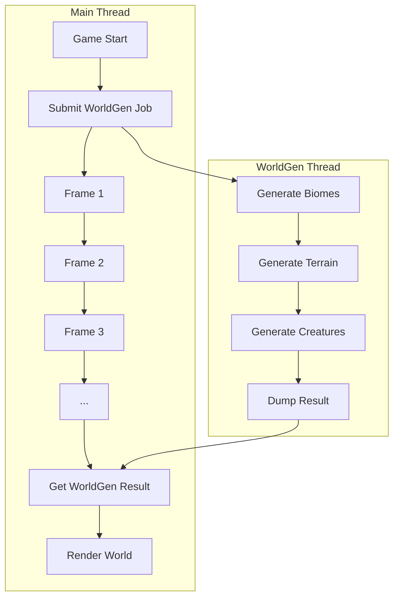

pocketpy organizes its state by `VM` structure.
Users can have at maximum 16 `VM` instances (index from 0 to 15).
Each `VM` instance can only be accessed by exactly one thread at a time.
If you are trying to run two python scripts in parallel refering the same `VM` instance,
you will crash it definitely.

However, there are two ways to achieve multi-threading in pocketpy.

One way is to use a native threading library such as `pthread`.
You can wrap the multi-threading logic into a C function and bind it to pocketpy.
Be careful and not to access the same `VM` instance from multiple threads at the same time.
You need to lock critical resources or perform a deep copy of all needed data.

## ComputeThread

The other way is to use `pkpy.ComputeThread`.
It is like an isolate in Dart language.
`ComputeThread` is a true multi-threading model to allow you run python scripts in parallel without lock,
backed by a separate `VM` instance.

`ComputeThread` is highly designed for computational intensive tasks in games.
For example, you can run game logic in main thread (VM 0) and run world generation in another thread (e.g. VM 1).



#### `main.py`
```python
import time
from pkpy import ComputeThread

thread = ComputeThread(1)
print("Game Start")

# import worldgen.py
thread.exec('from worldgen import gen_world')

print("Submit WorldGen Job")
thread.submit_call('gen_world', 3, (100, 100), 10)

# wait for worldgen to finish
for i in range(1, 100000):
    print('Frame:', i)
    time.sleep(1)
    if thread.is_done:
        break

error = thread.last_error()
if error is not None:
    print("Error:", error)
else:
    retval = thread.last_retval()
    biomes = retval['biomes']
    terrain = retval['terrain']
    creatures = retval['creatures']
    print("World Generation Complete", len(biomes), len(terrain), len(creatures))
```

#### `worldgen.py`
```python
import time
import random

def gen_world(biome_count: int, terrain_size: tuple[int, int], creature_count: int) -> dict:
    # simulate a long computation
    time.sleep(3)

    # generate world data
    all_biomes = ["forest", "desert", "ocean", "mountain", "swamp"]
    all_creatures = ["wolf", "bear", "fish", "bird", "lizard"]

    width, height = terrain_size

    terrain_data = [
        random.randint(1, 10)
        for _ in range(width * height)
    ]

    creatures = [
        {
            "name": random.choice(all_creatures),
            "x": random.randint(0, width - 1),
            "y": random.randint(0, height - 1),
        }
        for i in range(creature_count)
    ]

    return {
        "biomes": all_biomes[:biome_count],
        "terrain": terrain_data,
        "creatures": creatures,
    }
```

Run `main.py` and you will see the result like this:
```
Game Start
Submit WorldGen Job
Frame: 1
Frame: 2
Frame: 3
Frame: 4
World Generation Complete 3 10000 10
```

`ComputeThread` uses `pickle` module to serialize the data between threads.
Parameters and return values must be supported by `pickle`.
See [pickle](https://pocketpy.dev/modules/pickle/) for more details.

Since `ComputeThread` is backed by a separate `VM` instance,
it does not share any state with the main thread
except for the parameters you pass to it.
Therefore, common python modules will be imported twice in each thread.

If you want to identify which VM instance the module is running in,
you can call `pkpy.currentvm` or let your `ComputeThread` set some special flags
before importing these modules.
